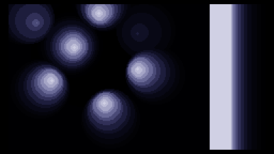

# stroboscope - TIC-80 512b intro - Inércia 2022

This repository contains the unpacked source for the TIC-80 512b intro
"stroboscope", made by pestis / brainlez Coders! and released at Inércia 2022
512b compo.

Capture: https://www.youtube.com/watch?v=j5o7avY4vO4

Source: https://github.com/vsariola/stroboscope

Tested with TIC-80 1.0.2164 pro. Packed with
[pakettic](https://github.com/vsariola/pakettic). Music tracked with slightly
customized [crackle-tracker](https://github.com/vsariola/crackle-tracker).

Greets to psenough, jeenio, havoc, superogue, HellMood, jobe, nesbox, dave84,
TomCat, exoticorn, ferris, Jin X, ttg, unlord, gopher, okkie, Řrřola, hannu,
wrighter, Dresdenboy, aldroid, baze, noby, p01, PoroCYon, DevEd, byteobserver,
sensenstahl, Virgill, Ped7g, gasman, LJ, ilmenit, deater, Fready, Blossom and
everyone at the Sizecoding discord!

Technical:
  - Clear screen, draw a black ball or bar, then draw the lights and the
    scanning rectangle on top. The scanning rectangle is lame, but was added to
    make the screen a bit more busy.
  - Since there is nothing like a "blend mode" in TIC-80, a max-blending is
    faked by drawing everything in order from darkest to lightest, so the
    lightest colors appear on top.
  - The light sources on the ball are distributed using fibonacci sphere
    algorithm. But spiral slope (what normally should be the golden ratio) is
    varied, so the first time you see the ball, the slope is 0 and the lights
    are still in a straight line.
  - Custom palette setting copy-pasted from my [Byte Battle
    notes](http://www.sizecoding.org/wiki/Byte_Battle)
  - The light sources rotate around the sphere, and the rather complex looking
    math.min madness is just checking if the circle currently being drawn would
    be obscured by the object; if so, then don't draw it. But the radius is
    smoothly decreased when the light is starting to be obscured, so that the
    lights don't suddenly disappear when going behing the object.
  - The bars are just done just by setting the y-coordinate of all light source
    to 0 (middle of the ball), and then drawing screen filling rectangles
    instead of circles.
  - The vertical vs horizontal bars are done by rotating the primitive drawing
    by 90 degrees.
  - The new thing added to crackle tracker was that the pattern note numbers are
    from the diatonic scale, instead of semitones. `*12//7` maps note numbers from
    the diatonic scale back to semitones.
  - The "transpose" in crackle tracker is added before this mapping, so it
    effectively is not just transposing a melody, but changing the mode the
    melody is played in (some kind of... modal mdulation I guess?). This allows
    same melody sound e.g. major or minor, depending of the current mode.
    Effectively, it's controlling how hands are moved left or right on the white
    keys of the piano. The melody contains mostly notes 1, 3 and 5 of the scale
    (and some passing notes), to better highlight the underlying major/minor
    chord.
  - Additionally, instead of just moving hands, when changing the mode, we do
    necessary inversions to the melody, to keep the keys used roughly in the
    same octave as before the modulation.

License: [MIT](LICENSE)

